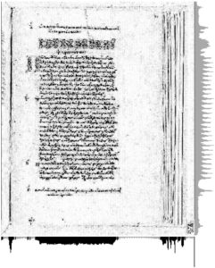
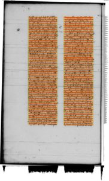

_This continues a [previous post](https://blog.ongcdh.org/experiments/client-side-line-detection/) that introduces the minor piece of code we'll be exploring below._

## Hello, Old Friend

Recently, two events coincided that inspired me to pull [this code](http://embed.plnkr.co/BYDuwd/) back out and take a second look at the process. The first is that our center charged a group of Computer Science majors with improving the effectiveness of our image processing algorithm as part of their [senior capstone project](https://github.com/CenterForDigitalHumanities/TPEN28/tree/capstone_version); the second was the seemingly [sudden](https://dhc.hypotheses.org/469#more-469) [burst](https://amdigital.co.uk/about/news/item/htr-planet) of [HTR](http://update.lib.berkeley.edu/2017/09/18/trial-colonial-america-with-handwritten-text-recognition/) promises, which depend on some level of layout analysis to work. In both cases, I was struck that improvements were accomplished in all cases with more processing power and additional layers of analysis. Although more of the outlier cases were falling into scope and well-formed documents were becoming more automatable, the simple cases were moving from realtime (<8 seconds) and into delays of minutes or hours in some cases before interaction with the results became possible. I do not want to diminish the scale of these accomplishments or sound like someone who gripes that I must wait almost two hours to board an airplane that will take me to the other side of the world in half a day. However, there are certainly use cases at the lower end of the complexity spectrum that may not require and cannot benefit from the horsepower being built into these new models.

I honestly don't know where this sample image came from (aside from the British Library), but it was in my cache when I lost WiFi years ago. It was time to feed this to the machine and see what happened. In short order, I wrote up a function to visualize the sums of the rows and columns to see if the text box seemed to be obvious. The result felt conclusive:

Setting a default threshold of 10% of the busiest row (marked in black beneath the image), the possible columns popped out as expected. I was also pleased to see that candidate rows appear without too much imagination. Obviously, there are some spots, such as the gutter and the page edges that do not represent a text area, but by simply constraining the width of the analysis and expecting the sawtooth of rows, I not only eliminated irrelevant "columns" but was able to detect separation within a column. I can easily imagine bracket glosses, round text paths, or heavily decorated text that would break this, but those are not my target. With no optimization and the inclusion of several heavy visualizations, I was able to render decent candidate annotations for column and line detection in about two seconds. At the lowest resolution, this time was under one-fifth of a second.

## Things take a turn

Rather than declare victory, I investigated the minor errors that I was able to find. While I expected and accepted pulled out capitals and paragraph numbers as well as the mischaracterization of a header graphic as text, it bothered me that one pair of lines was joined, though the visualization suggested their separation. I could fiddle with the thresholds to get a better result, but that also thinned the other lines beyond what made sense to me, so it was not a solution. Stepping through the numbers, it seemed that the slight rotation magnified the impact of the ascenders, descenders, and diacritics that busied up the interlinear spaces. It would not be unreasonable for this lightweight tool to require pre-processed images with good alignment, but some simple poking told me the amount that this image was "off" by was just around \-.75 degrees which feels close enough for most humans to consider this a good photo. Instead I began to imagine the shadow cast by a rotating text box and experimented with rotations that made the column curve more round or severe.

\[gallery size="medium" columns="1" link="file" ids="817,815,816"\]

They were mathematically different, but determining the best fit was becoming more and more complex, which undermined the original purpose. A simple check of the rotation that produced the narrowest column was possible, and seemed to always be true for the best rotation, but automating that step was difficult on multiple columns and it was too easy to miss the best rotation if the interval was set too high. I looked at column widths, row counts, the difference between max and min values for a host of metrics, but nothing reliably predicted the correct rotation.

## Always Assume

After carefully recording and comparing characteristics of good and bad fits across several images, I discovered an assumption about manuscripts that I was not yet leveraging—rows are regular. Even with variety, most ruled manuscripts will be dominated by rows of similar heights. I updated the function to select the best rotation based on the minimum standard deviation from the mean value for  row height. This calculation is lightweight for the browser and the rows are already calculated at each step of determining column boundaries, so there was minimal overhead. As a default, I evaluate each degree from -3 to 3 and then rerun around the lowest value with half the interval until the interval is under one-eighth of a degree. Without caching checks or eliminating intermediate renders, this process takes longer, but it regularly finds the best rotation for a variety of documents. On my machine, it takes about 1 millisecond/pixel processed (40 seconds with the sample image), but the back of my envelope records 9⁄22 of these tests as redundant, which means a simple caching optimization will put this process under twenty seconds. Using this method, an incredibly problematic folio (microfilm, distorted page, skewed photography, tight lines) is not only rotated well, but is evaluated with incredible precision.

\[caption id="attachment\_819" align="aligncenter" width="826"\] Robert Grosseteste, Eton College Library 8\[/caption\]

\[caption id="attachment\_820" align="alignright" width="182"\] Full page, rotated 1.375 degrees, 52 rows in 2 columns\[/caption\]

## Next Steps

This is not remarkable because it is possible, but because it is mathematically simple and reasonable to accomplish on a client. This not only means the transcription (or generic annotation) application does not need to sideload the image to process it, but also that any image can be offered, even one off the local machine or that doesn't use helpful standards like IIIF. One can imagine this analysis may be available for any image within the browser through a bookmarklet or extension. Once analyzed, these annotations could be sent to a service like [Rerum,](http://rerum.io) saved into LocalStorage for later recall, or sent directly into a transcription tool like [TPEN](http://t-pen.org).

Within an application, this tool can be even more powerfully used. Without requiring a complex API to save settings, a user may tweak the parameters to serve their specific document and reuse those settings on each page as the interface renders it. Even if the line detection is inaccurate or unused, the column identification may be helpful to close crop an image for translation, close study, or to set a default viewbox for an undescribed page.

This is not part of any active project and just represents a couple days spent flogging an old idea. [The whole thing](https://cubap.github.io/dash/) such as it is [has a github repository](https://github.com/cubap/dash), but isn't going to see action until there is a relevant work case. What do you think? Is this worth a few more cycles? How would you use a tool like this, if you could do lightweight image analysis just in your browser or offline?
