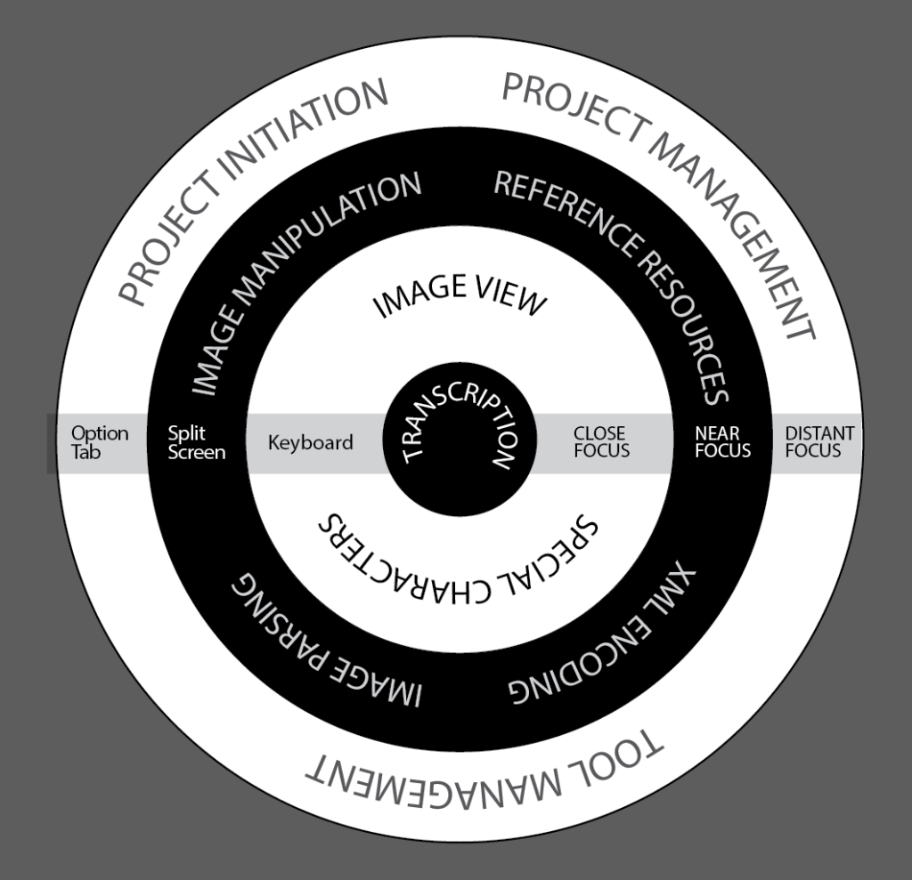

The last blog covered a little bit about what challenge we laid out for ourselves in reworking the T-Pen Transcription interface. We set out to see if we could arrange and reorder the interface to be cleaner, easier to use, improve the access to the hidden tools, privilege the most used tools be more consistent in the tool functioning but not abandon any tool. In the last blog we talked about what we did to support transcription directly. In this blog we will talk a little about how we arranged our tools around transcription and we set the various tools at different distances from the transcription fiction but as a matter of physical layout and through different modes of interaction.

In the last blog we identified a variety of modes of interaction such as split screens, pop overs, redirects into management tools or simple buttons for tool selections. While the list of modes of interaction gave us the greatest opportunity to simply and refine the UX of the transcription tool it was not in the immediate way of reducing the number of ways the user could interact with the interface but rather what was being done with each approach and why. By doing this we were able bring tools together as a matter of their form and function but more importantly we were able to identify the distance the interaction put the user at from transcription and use that as way to give a hierarchy and order to the interface.

**(un)Wrapping the Onion.** To organize our hierarchy we identified a series of layers (like an Onion), established the level of focus required for the scholar vis a vie the performance of Transcription and assigned the modes of interaction to support that. The closer to the center a function lies then the less distraction and easier it should be to use. We ended up with transcription, Close Focus/Keyboard, Near Focus/Split Screen and the outer layer of Distant focus/Option tab. 

 

**Transcription** Transcription we didn't change much. But we did add auto detect character set so with RTL characters the text box will adjust the presentation of those to show them correctly. This is part of our efforts to broaden the functionality of T-Pen in the coming years in response to requests for such support. We also developed a beta RTL variant that can be activated via the Option Tab but more on that in a later blog.

**Close Focus/Keyboard** This is the layer closest to transcription and we placed those tools and features that would be most used during the act of transcription. Ease of view the image for instance. For an example we will use one of the tools mentioned in the last blog on this topic; Peek Zoom (CTRL Shift). This function makes the line being transcribed fit the width of the window. In many cases this means the line is enlarged and presented above the transcription tool. In some cases the line in reduced in size (if the window is narrower than the line for instance) but this means the whole line is visible so that it may help with context for the transcription of an abbreviation. By making this a key command it becomes something the user can do without breaking their focus on the translation. Thus we identified this function as needing to be close to the core function and enabled that through its vitiation via key command. Similarly, 'special characters'(the first 9 characters at least) and 'hide workspace' have key commands to keep the users focus where it should be; on the transcription. We also have option ↑ and option ↓ to help savage lines quickly so as not break the transcribers flow. Although the special characters is not a perfect fit for key command as we will talk about later.

**Near Focus/Split Screen** When transcribing in the traditional way the user would occasionally have to break that focus on transcription to check Cappelli or a dictionary, or picked up a magnifying glass to look at something more easily. The user begins to engage withe the manuscript at the more at the page level and less at the single line. In such cases the user disengages from the act of transcription but still remain engaged with parts or th whole of the presented page. The tools and features that fall in this layer can also reduce that tight focus on the act of transcription. We achieved this by using the split screen functionality for this layer. Resources such as dictionaries and Cappelli were already here. Split screen as a mode of interaction allowed us to clean up the interface too as there were a number of existing resources and tools that were split screen. To activate this mode required a mouse action but it didn't matter either that happened by a button or a pull down. In moving to a pull down we were ablate clean up the interface as well as put related resources and tools together in the same place as well as reduce their visibility a little for that cleaner workspace. But we didn't find that worked for some tools that made sense to be together but each was too small in themselves to be a single split screen and were in function a little closer to the core function of transcription than the resources in the split screen pull down. These we put together as Page Tools and set this out as a button rather than as part of the split screen drop down to bring the tools in contains a little closer to the user.

**Distant focus/Option tab.** This layer is the one closest to the existing version of T-Pen in its form. This is for tow reasons the mode of interaction was very suitable for the the features and tools that fall in that layer but also because we were looking to update the transcription interface not the whole site and this represents the point at which the user is stepped away from the transcription completely and looking to administer the project as a whole rather than perform the act of transcription.

**The exception(s) that prove the rule** There are a couple of tools that have not been mention in this blog post that don't quite fit into these layers. Inspect, Characters and XML tags. In terms of focus Inspect and XML tags fit into the Near focus zone of our onion.  Characters fits better in the close focus range. Characters, as we have already talked about has key commands mode of interaction for character insertion but there are two major demands that insist we do more than key command. Firstly in the classic version of T-Pen all the buttons could be viewable and secondly any character could be inserted by using the characters as buttons. This was case where if it not broken it is not in need of fixing. The same argument holds for the XML tags. Also the XML tags are more distant from the act of transcription. XML adds to and helps to erode the text but it is not transcription in itself. While many of our users use XML tags, the way in which they use them and the degree to which they use them varies greatly. The XML tags can be used as insertion of opening tag with a closing tag reminder in the bottom left of the text input box or as text highlighted and opening and closing tags inserted at the same time. In either case the user takes a hand off the keyboard to engage withe transcription in a different way that straight input.  This means to bring key commands to the XML tags would be complex, and reduce the ways in which the XML tags cam be inserted for what is a little gain for some users and a loss for a lot of others seems not to be worth the rope. the final rule breaker is inspect. Again the focus is near as the function is to allow the user to look more closely at a detail that the peek zoom or hide workspace options don't help with so the user must again lift their hand, mentally and physically, away from the transcription to metaphorically and lift a magnifying glass. Putting this in the split screen doesn't make sense as it burns the function amid resources when it it is not and it stands a little closer to the transcription than the split screen tools do.

All in all the new T-Pen interface is a mixture of changes, continuations and, we hope, clarity for our users.

**Next time: Pages tools and getting more out of your images**
