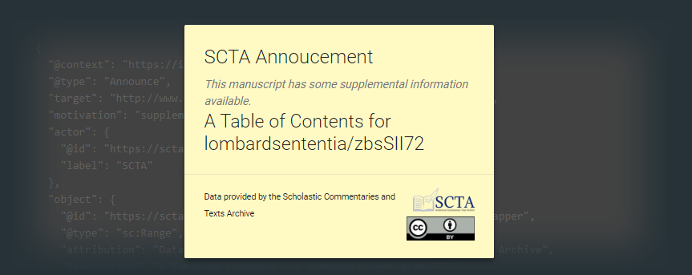
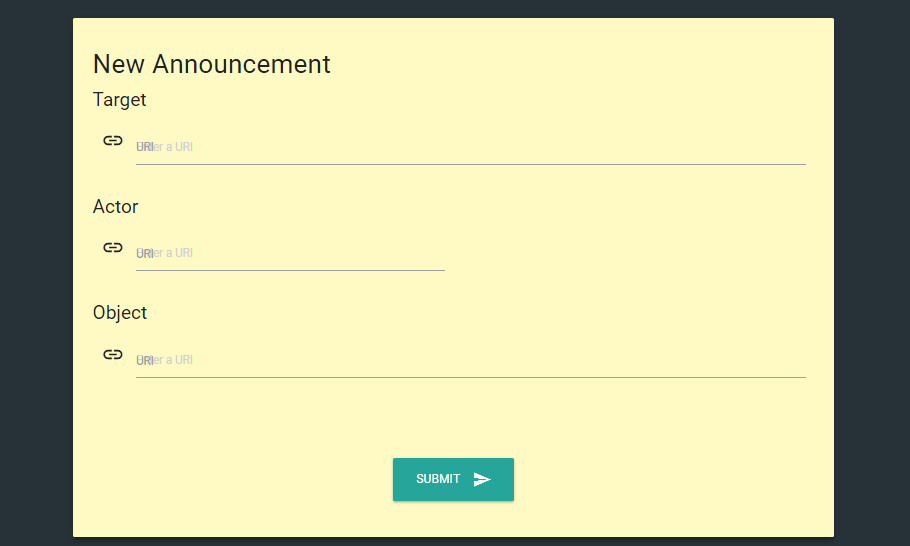

Two complementary updates have popped up from OngCDH and our friends. The first extends the functionality of the The Mirador LDN Plugin to include more object types and the second is a new interface on the [Rerum Inbox website](http://inbox-docs.rerum.io) which makes it easier for anyone to post supplemental content for public IIIF Manifests.

## Mirador IIIF LDN Plugin

This wonderful contribution to the Mirador community from Jeffrey C. Witt has been [on github](https://github.com/jeffreycwitt/mirador-ldn-plugin) since July 2017 and accomplishes the simple task of supplementing IIIF Manifest objects with additional information available from Linked Data Notification ([LDN](https://www.w3.org/TR/ldn/)) inboxes listed in the Manifests or hosted as a Rerum Inbox.

It was originally created with Tables of Contents in mind and has continually been updated to support the sorts of `sc:Ranges` objects that make up ToCs and other structures within Manifests. In this way, a scholar (or organization) who has created content that supplements a Manifest to which she has no access (for example, one hosted at a national library) can enhance the available information without imposing on or mirroring the original object in its hosting repository.

[caption id="" align="aligncenter" width="1425"] The Mirador plugin in use at https://mirador.scta.info[/caption]

The plugin creates a simple UI (above) for exposing to the user when an [Announcement](https://www.w3.org/ns/ldp) is available for the resource loaded into the window and prompting to include it as part of the working object. Having proven itself with Range objects, the next step was to include annotations.

Annotations in IIIF follow the [Web Annotation](https://www.w3.org/TR/annotation-model/) and [IIIF Presentation](http://iiif.io/api/presentation/2.1/) standards. Within IIIF (and Mirador), each `sc:Canvas` may have an `otherContent` property that contains an array of `sc:AnnotationList` objects. Related lists are aggregated into `sc:Layer` objects which span entire Manifests. These Layers are used for commentary or transcription and are often not part of the Manifests hosted by large institutions, as it is more common that they are the result of research than cataloguing or digitization activities.

As of 20 February 2018, the plugin detects and renders announcements of the types `sc:Layer` and `sc:AnnotationList` in addition to the `sc:Ranges` type previously supported. IIIF Presentation 3.0 objects, such as \`as:OrderedCollection\` and  \`as:OrderedCollectionPage\`, are allowed by the Inbox, but have not yet been integrated into the plugin for rendering in Mirador. Moving forward, additional cases for supplementary metadata, canvas images, and publication and review will be considered. Visit the plugin [on github](https://github.com/jeffreycwitt/mirador-ldn-plugin) to contribute stories or code.

## Rerum Inbox

Linked Data Notifications are useless without somewhere to announce them, so the Walter J. Ong, S.J. Center for Digital Humanities created the [Rerum Inbox](http://inbox-docs.rerum.io) and offer it free to the world as a place to post and retrieve notifications about any resource, even if it doesn't declare the service itself. Since August 2017, Rerum Inbox has been accepting notifications through direct HTTP Requests. The website provided the specification and explained the purpose, but otherwise had not been terribly useful.

### Inbox Lookup

Now there are two simple interfaces provided for anyone who wishes to explore Linked Data Notifications in the Rerum Inbox without reaching for the command line. The first discovers if the provided resource is targeted by any notifications. Of course IIIF Drag 'n Drop [

### Create Announcements

If you have just a couple resources to supplement, there is a quick tool](https://purl.stanford.edu/hg676jb4964/iiif/manifest "Try Me!") [on the site](https://centerfordigitalhumanities.github.io/inbox-docs/#!/postit) to leave a notification without much fuss. Provide the target (a dereferenceable URI will be verified), the actor (if the URI of the person or organization does not reference a label, you may provide one), and the object itself (with a dereferenceable URI, other preferred fields will be filled out automatically) and click "submit" to post a new announcement. For simplicity, this interface creates only default notifications of the type `Announce` and the motivation `supplementing`, so if you need something else, you'll still have to do it yourself.

With these two updates, we hope to increase the use of both the Rerum Inbox and the contributions to these projects by the communities they serve. If you have suggestions about how to improve either of these offerings, please leave a comment below or visit their respective github repositories to leave an issue or pull request.
